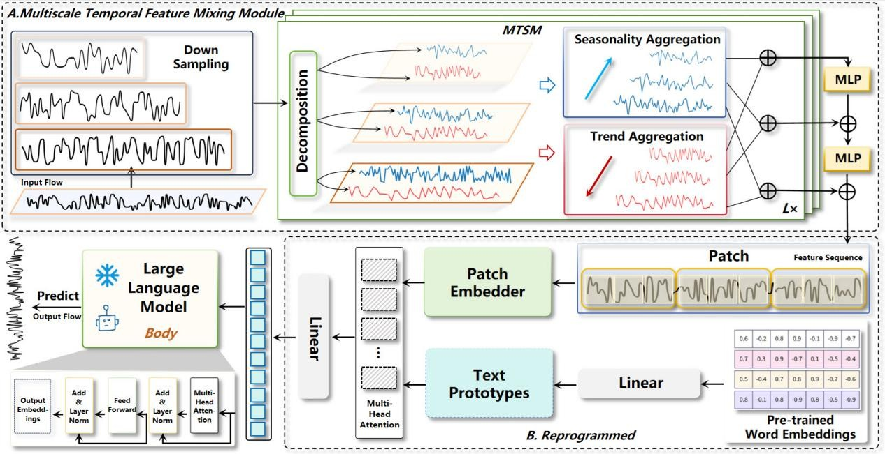

# ReMFT
We propose a model to enhance traffic flow forecasting by integrating multiscale feature extraction and semantic fusion through LLM-driven reprogramming, which is structured into two key stages, as shown in the figure. Firstly, we extract spatiotemporal features from traffic flow data through multiscale decomposition, capturing trends and seasonal components at different frequencies, thereby improving the model's ability to predict short-term fluctuations and long-term trends. Second, we apply LLM-driven reprogramming to perform semantic fusion on the traffic flow data, aiming to enhance prediction accuracy.

## Usage
1.Install the environment based on requirements.txt  
2.Download PEMS03.npz, PEMS04.npz, PEMS07.npz, PEMS08.npz and put them into ./data  
3.Download llama-7b, gpt-2, bert and put them into ./LLM  
4.run run.ipynb
