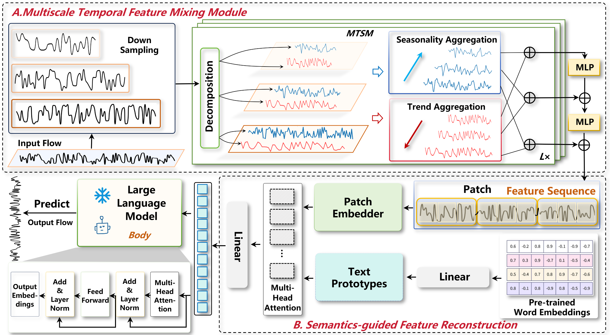

# ReMFT
We propose a novel framework to enhance traffic flow forecasting, as illustrated in the Figure. The framework begins by performing multiscale decomposition on the original time series, partitioning it into a set of sub-sequences at different temporal resolutions. This step enables the model to capture temporal patterns across various time granularities. Subsequently, we introduce the Multiscale Trend-Seasonality Mixing (MTSM) module, which extracts trend and seasonal components from each sub-sequence. By aggregating these components across scales using weighted fusion, the model effectively captures both short-term and long-term temporal dynamics, thereby improving its capacity to represent complex temporal patterns. Building upon this, a Multi-Layer Perceptron (MLP) is employed to integrate the representations of sub-sequences across multiple scales, enhancing the model’s expressive power and predictive robustness. To further improve the model’s ability to understand latent semantic patterns in the time series, we incorporate the embedding space of a pre-trained LLM into the representation learning process. Specifically, by reprogramming the input data, feature sequence blocks are mapped into the LLM’s token embedding space to construct semantic prototypes. A cross-attention mechanism is then applied to inject semantic-level information into the model. This design effectively activates the LLM’s capability to comprehend and reason about complex semantic structures embedded in the feature sequences, thereby contributing to improved performance in time series forecasting tasks.

## Usage
1.Install the environment based on requirements.txt  
2.Download PEMS03.npz, PEMS04.npz, PEMS07.npz, PEMS08.npz and put them into ./data  
3.Download llama-7b, gpt-2, bert and put them into ./LLM  
4.run run.ipynb
